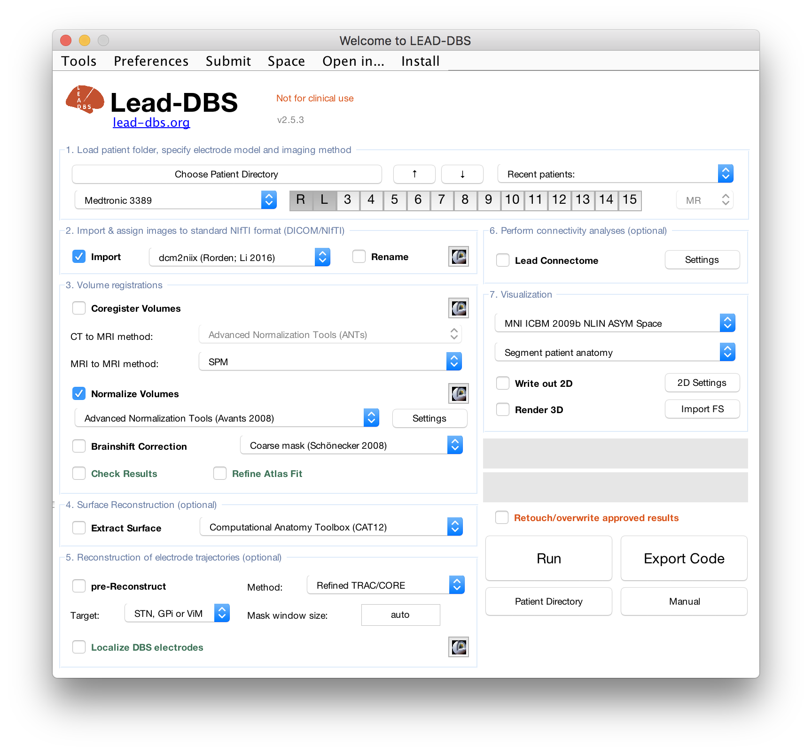

# 0. Main Window

The main window of Lead-DBS is divided into 7 sections:

1. Load patient folder, specify electrode model and  imaging method
2. Import data
3. Volume registrations
4. Surface reconstruction \(optional\)
5. Reconstruction of electrode trajectories \(optional\)
6. Connectivity analyses \(optional\)
7. Visualization

The button `Run` in the bottom right runs **all** processes that are checked within the main window.

To run only one specific process, please make sure that only the desired checkbox is selected. Checkboxes marked with a **bold** text-face address steps that actually perform an analysis themselves, other checkboxes \(standard text-face\) are used as options within certain processes.

Hovering over the checkboxes with the mouse will show an explanation of each element of the Main Window.

